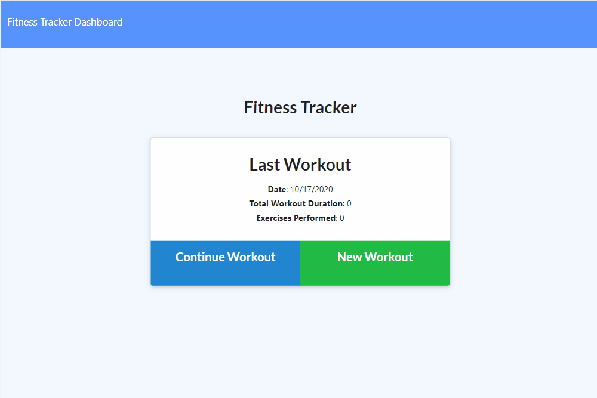

# **Fitness Tracker**


## Description

An application with a MongoDB database deployed on Heroku that allows a user to add thier fitness exercises and then continue to track their progress throughout the week.

# Technologies Used


## Table of contents

- [Installation](#installation)
- [Instructions](#instructions)
- [Features](#features)
- [Example Gif](#example-gif)
- [Repository Link](#Repository)
- [Test](#Test)
- [Licence](#Licence)
- [GitHub Info](#GitHub)

## Installation

```
npm install
```

## Instructions

Application deployed on [Heroku](jms-fitness-tracker.herokuapp.com/).

## Features

As a user, I want to be able to view create and track daily workouts. I want to be able to log multiple exercises in a workout on a given day. I should also be able to track the name, type, weight, sets, reps, and duration of exercise. If the exercise is a cardio exercise, I should be able to track my distance traveled.

## Example Gif



## Repository


- [Project Repo](https://github.com/wasteofadrumbum/Fitness-Tracker)

## Contributors

none


## Test


## Licence


## GitHub


- Joshua M. Small
- [GitHub Profile](https://github.com/wasteofadrumbum)
- <JMSmall89@gmail.com>
- 
